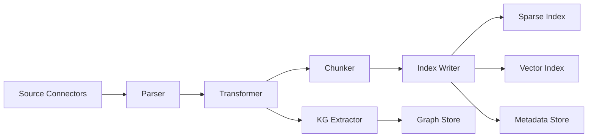
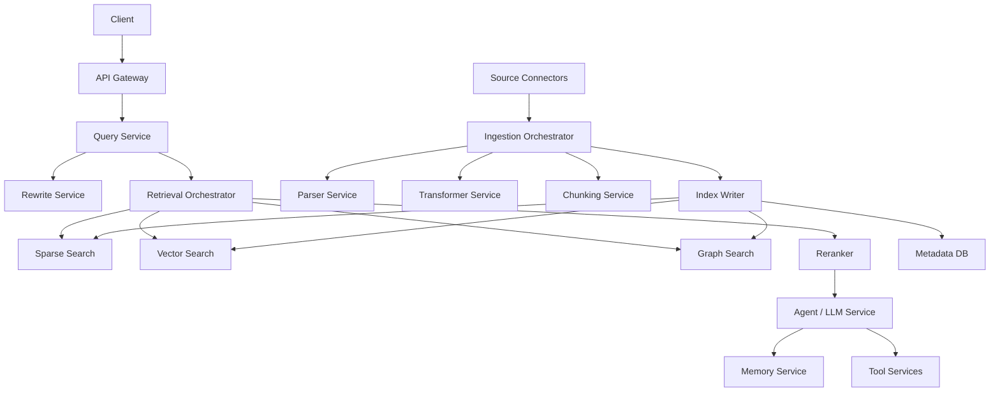

# Assignment 4 — Architectural Analysis of RAGFlow

**Course:** Artificial Intelligence (Spring 2026)  
**Topic:** Architectural Analysis of RAGFlow as a Modern RAG + Agent System

RAGFlow positions itself as an end-to-end RAG engine that combines deep document understanding, hybrid retrieval, and agent capabilities into a unified context layer for LLM applications. It also exposes a configurable ingestion pipeline, parser choices for PDFs, memory management APIs, and multiple backend options such as Elasticsearch-like engines and Infinity. This report answers the ten required design questions while generalizing the lessons beyond RAGFlow to production RAG systems more broadly. 
Sources: [RAGFlow GitHub](https://github.com/infiniflow/ragflow), 
[Ingestion pipeline quickstart](https://ragflow.io/docs/ingestion_pipeline_quickstart), 
[Parser component](https://ragflow.io/docs/parser_component), 
[Select PDF parser](https://ragflow.io/docs/select_pdf_parser), 
[Release notes](https://github.com/infiniflow/ragflow/blob/main/docs/release_notes.md).

---

## 1. Deep document understanding vs naive chunking

RAGFlow emphasizes layout-aware parsing through DeepDoc and configurable PDF parsers. Deep document understanding outperforms fixed-size chunking in enterprise RAG because enterprise documents are rarely plain text streams: they contain tables, multi-column layouts, section hierarchies, footnotes, figures, headers, and metadata. If a pipeline ignores this structure, it destroys the semantic boundaries that users actually query against.

### Retrieval fidelity

Fixed-size chunking often breaks atomic units of meaning. A table can be split across chunks; a heading can be separated from the paragraph it scopes; a footnote can be embedded into unrelated text. The consequence is retrieval mismatch: the retriever may return a chunk that contains the lexical answer tokens but not the surrounding structural context needed for correct interpretation.

Deep parsing improves fidelity by preserving document-level semantics such as section titles and nesting, page regions and layout roles, table cell groupings and header mappings, and metadata such as source file or page number. In enterprise RAG, many questions are implicitly structural, for example: “What does the Q4 revenue table say about EMEA?” or “In the policy appendix, what is the exception for contractors?” These are not only semantic lookups; they are scoped lookups over layout and hierarchy.

### Index design

Naive chunking typically yields a single homogeneous index of text windows. Deep parsing encourages a richer index design with text nodes, table nodes, section nodes, metadata fields, and parent-child relations between layout elements. This enables field-aware retrieval and re-ranking. A query about “annual recurring revenue by region” should be able to bias table objects and preserve row/column associations instead of flattening everything into prose.

### Preprocessing cost

The trade-off is preprocessing cost. Layout-aware parsing requires OCR, table structure recognition, document layout recognition, and parser orchestration. RAGFlow’s parser documentation explicitly shows that PDF extraction can be configured differently depending on document complexity, and that users may skip advanced parsing for plain-text PDFs to reduce latency and cost. This is the right design principle: pay the parsing cost only when structure matters.

**Conclusion:** Deep document understanding wins when retrieval quality depends on preserving structure, but it increases ingestion latency, operational complexity, and parser cost. The correct architectural pattern is selective depth: use rich parsers for complex documents and cheaper parsing for simple text.

---

## 2. Chunking strategy: template vs semantic

RAGFlow supports configurable chunking rather than forcing a single strategy. The two relevant extremes are template-based chunking and embedding-driven semantic segmentation.

### Template-based chunking

Template chunking uses document structure rules known in advance, for example one section per chunk, one slide per chunk, one law article per chunk, or one row group in a financial statement per chunk. This works extremely well when the corpus is highly regular. It preserves semantics that arise from known templates rather than trying to infer them from embeddings.

### Embedding-driven semantic segmentation

Semantic segmentation uses meaning shifts to split text where the topic changes. This is useful when document structure is weak, noisy, or inconsistent. It is more adaptive than templates but can be unstable in corpora with abrupt context shifts or short-form fragments.

### Failure analysis

**Highly structured documents (financial reports):** semantic segmentation fails more often. The embedding model may not recognize that a table header and a following row block must remain together. It may over-segment repeated phrases or under-segment because neighboring rows are lexically similar. Template chunking is better because the structure is explicit and often more informative than local semantic similarity.

**Loosely structured corpora (chat logs):** template chunking fails more often. A fixed rule such as one conversation window every N messages ignores discourse turns, topic drift, and speaker dependencies. Semantic segmentation performs better because chat logs are topic-driven rather than layout-driven.

### Design lesson

This is not a binary choice. Production systems often use a hybrid policy: template rules where structure is authoritative, semantic segmentation where structure is weak, and chunk-size caps and overlap as safety constraints. The architectural lesson is that chunking is a corpus-dependent optimization problem, not a universal constant.

---

## 3. Hybrid retrieval architecture

RAGFlow combines lexical retrieval, vector retrieval, and re-ranking. Formally, hybrid retrieval improves quality because lexical and dense models have partially overlapping but non-identical relevance sets.

Let \(R_L\) be relevant documents recovered by lexical retrieval and \(R_D\) be relevant documents recovered by dense retrieval. Hybrid retrieval improves recall whenever \(R_L \cup R_D\) is significantly larger than either set alone. Re-ranking then improves precision by ordering the union using a more expensive but more faithful scorer.

### Why lexical-only fails

BM25-style retrieval is strong when exact terminology matters, but it fails on semantic mismatch: synonyms, acronym expansion, paraphrased policy language, and naming variants. Lexical retrieval also underperforms on short or underspecified queries where exact token overlap is sparse.

### Why vector-only fails

Dense retrieval is good at semantic matching but can fail on rare entity names, exact codes and SKUs, numerical identifiers, and domain-specific keywords where the embedding model underweights exact match. It can also retrieve semantically similar but operationally wrong content, which is dangerous in enterprise settings.

### Why hybrid can still fail

An edge case for hybrid retrieval is when both branches retrieve high-recall but semantically broad candidates, and the relevant item is buried under many near-duplicates or boilerplate records. In that case, recall is fine but precision depends heavily on re-ranking and metadata filters. Another hybrid failure occurs when the corpus is polluted with duplicated low-quality chunks; the union step increases candidate noise and makes the reranker work harder.

### Bottom line

Hybrid retrieval is not magic. Its real advantage is diversity of candidate generation. Re-ranking is what turns that diversity into usable precision.

---

## 4. Multi-stage retrieval pipeline

RAGFlow decomposes retrieval into candidate generation, re-ranking, and query refinement. This is superior to a single-pass ANN search because retrieval is inherently a cascade problem: cheap approximate methods are good for breadth, expensive cross-encoders or agentic query transformations are good for accuracy.

### Recall vs latency trade-off

A single ANN pass is fast but constrained. If you set it aggressively for latency, you lose recall. If you broaden it, you increase candidate noise. A multi-stage pipeline resolves this tension: Stage 1 uses high-recall candidate generation, Stage 2 applies expensive reranking on a smaller set, and Stage 3 optionally invokes query refinement if confidence is low. This is analogous to web search cascades: retrieve wide, score deep.

### Cascading error propagation

The downside is cascading error. If the first stage misses the relevant chunk, later stages cannot recover it. If query rewriting introduces drift, the reranker may optimize around the wrong intent. Therefore, each stage should expose confidence signals and fallback behavior. A good production policy is to keep candidate generation broad enough to preserve recall, use reranking only on manageable candidate sets, and invoke query refinement selectively when ambiguity or low confidence is detected.

### Why not single-pass?

Single-pass ANN treats retrieval as one optimization target, but in practice retrieval has at least three competing objectives: coverage, ranking accuracy, and latency budget. A staged design is the only practical way to optimize all three simultaneously.

---

## 5. Indexing strategy and storage backends

RAGFlow supports switching between document engines, including Elasticsearch-like backends and Infinity, rather than hard-coding one store. The right backend depends on workload shape.

### Elasticsearch-like hybrid store

Best for mixed structured/unstructured search, strong metadata filtering, compliance-heavy enterprise search, and workloads with lots of exact-match constraints. Its advantages are a mature inverted index, strong filter semantics, robust operational tooling, and hybrid sparse plus vector support. Its weaknesses are that vector functionality may lag specialized vector DBs in scale or performance, and graph-like reasoning is awkward.

### Vector-native DB

Best for semantic search over large embedding corpora, dense retrieval at low latency, and workloads where exact boolean filtering is secondary. Advantages include optimized ANN search, good embedding-centric throughput, and simpler scaling for pure vector use cases. Weaknesses include weaker text ranking and filter expressiveness than search-first systems, and poorer explainability.

### Graph-augmented store

Best for entity-centric workflows, compositional reasoning, multi-hop dependency questions, and lineage or relationship-heavy corpora. Advantages include explicit relations and constraints, better support for symbolic traversal, and strong explainability for relationship-based answers. Weaknesses include higher construction and maintenance cost and weaker broad semantic recall than sparse or dense stores.

### Design criteria

Choose based on query mix, ingestion frequency, latency SLOs, metadata complexity, explainability needs, and team operational maturity. The general lesson is that one backend is often suboptimal; large systems increasingly separate sparse, dense, and graph layers behind a retrieval orchestration service.

---

## 6. Query understanding and reformulation

RAGFlow supports query rewriting and multi-turn optimization. Query transformation is critical because user queries are often not retrieval-ready. They may be vague, under-specified, or phrased in language that differs from the corpus.

### Static query to retrieval

A static query pipeline sends the user query directly to retrieval. This is simple and low-latency, but brittle. It assumes the user already knows how to speak in the corpus’ vocabulary.

### Iterative query refinement

Agent-driven refinement allows the system to expand synonyms, decompose multi-part questions, clarify missing constraints, and translate user phrasing into retriever-friendly forms. This is valuable when the semantic gap is large. For example, “How do we handle employee departures?” may need expansion into “offboarding,” “termination,” “access revocation,” and “equipment return.”

### Trade-off

Refinement improves recall and answerability, but introduces latency and risk of query drift. Over-aggressive rewriting can change the task instead of clarifying it. Therefore, iterative reformulation should be confidence-triggered rather than always on.

### Principle

Query transformation is a retrieval optimization layer, not just an LLM convenience layer. In RAG, the best answer often depends more on asking the right retrieval query than on using a stronger generator.

---

## 7. Knowledge representation layer

RAGFlow can use dense embeddings, metadata layers, and knowledge graphs. These are not interchangeable; they optimize different reasoning modes.

### Dense vector space

Best for semantic similarity and fuzzy matching. It excels at recall over paraphrases and unstructured text. Compositional reasoning is weak by itself because vectors encode similarity, not explicit relations. Explainability is limited because similarity scores are hard to interpret.

### Relational schema

Best for structured records, joins, filters, and aggregate reasoning. Compositional reasoning is moderate; it is good for compositional queries expressible as filters and joins. Explainability is strong because columns, predicates, and joins are inspectable.

### Knowledge graph

Best for relationship-centric and multi-hop reasoning. Compositional reasoning is strongest when the task depends on explicit entities and edges. Explainability is also strong because paths and subgraphs can be shown as evidence.

### Comparison

Vectors are best for broad semantic recall. Relational schema is best for structured precision. Knowledge graphs are best for explicit compositional reasoning. A mature RAG system often uses all three, with the retriever choosing which representation to query based on task type.

---

## 8. Data ingestion pipeline architecture

RAGFlow’s ingestion pipeline is explicitly componentized into parser, transformer, chunker, and indexer stages. This is the correct architecture for heterogeneous enterprise data.

### Schema normalization across sources

A robust ingestion system must normalize PDFs, spreadsheets, images, emails, HTML, JSON, audio, and video into a common internal document model. The point is not to erase source differences, but to express them through typed fields such as content blocks, metadata, source identifiers, parent-child structure, and modality annotations. Without normalization, retrieval becomes source-specific and brittle.

### Incremental indexing

Production corpora change continuously. Re-ingesting everything is wasteful and causes stale reads. The ingestion architecture should support content hashing, change detection, per-document or per-chunk upserts, tombstones for deletions, and version-aware re-indexing. This usually implies event-driven ingestion with idempotent stages.

### Consistency vs throughput

A strict synchronous pipeline gives stronger consistency but lower throughput. An asynchronous pipeline gives better throughput and fault isolation, but retrieval may temporarily serve stale indexes. The right balance is usually asynchronous ingestion for scale, version stamps for visibility, eventual consistency with freshness indicators, and retry queues with dead-letter handling.

### Architectural decomposition

This decomposition isolates failure domains: parsing failures do not corrupt index writes, and graph extraction can be optional rather than blocking.

---

## 9. Memory design in RAG systems

RAGFlow’s recent releases add memory management APIs and a chat-like interface retaining sessions and dialogue history. Memory in RAG should be treated as a multi-tier system, not a single feature.

### Vector memory

Stores semantically searchable interaction summaries or snippets. It is good for fuzzy recall of prior intent but weak on exact temporal or structured state.

### Structured memory

Stores durable user facts, tool results, and state variables in SQL or graph form. It is good for exact state retrieval and better for consistency than free-form vector memory.

### Episodic logs

Stores timestamped interaction traces. It is good for chronology and debugging, and useful for reconstructing why an agent took an action.

### Design trade-off

Vector memory helps semantic continuity, structured memory helps correctness, and episodic logs help auditability. A long-running agent should use all three: vector memory for fuzzy recall, structured memory for persistent facts, and episodic logs for temporal traceability. The release notes reinforce this direction by adding memory APIs and improving memory stability in recent versions.

---

## 10. End-to-end system decomposition

RAGFlow spans ingestion, indexing, retrieval, reasoning, and serving. A production deployment should decompose these into microservices based on statefulness, scaling behavior, and failure boundaries.

### Stateless vs stateful services

**Stateless services** include the API gateway, query rewriting, reranking workers, generation or orchestration workers, and document transformation services. These scale horizontally and can be autoscaled based on request volume.

**Stateful services** include the sparse index backend, vector DB, graph store, metadata DB, session and memory stores, and object storage for raw documents and derived artifacts. These require durability, replication, and backup strategy.

### Scaling strategy per component

- Parser/OCR services scale by ingestion queue depth; GPU and CPU pools may be separate.
- Chunking and transform workers scale elastically and are mostly CPU-bound unless using LLM transforms.
- Retrieval gateways scale with QPS and remain stateless.
- Rerankers scale independently because they are often model-bound and expensive.
- LLM or agent workers should be isolated from retrieval so generation spikes do not starve indexing.
- Indexes and memory stores scale based on storage and query patterns, not generic API traffic.

### Failure isolation boundaries

The system should isolate at least these boundaries: ingestion vs online query serving, retrieval vs generation, memory/session state vs transient chat workers, and backend-specific outages such as vector DB or search engine failures. If ingestion is broken, serving should continue on the last good index. If reranking is degraded, the system should fall back to hybrid retrieval rather than failing closed. If memory services fail, chat should degrade gracefully to stateless retrieval.

### Reference microservice layout

This separation makes the system operable at scale: each service can fail, scale, and evolve independently.

---

## Conclusion

RAGFlow is a strong reference architecture because it treats RAG as a systems problem rather than a single-model problem. Its design choices point toward the core principles of production RAG: preserve document structure when it matters, separate candidate generation from precise ranking, match storage backends to workload shape, invest in ingestion and memory as first-class components, and decompose the system into services aligned with state and scaling boundaries.

The broader lesson is that high-quality RAG is not just embedding plus prompt. It is an architecture of representations, indexes, pipelines, and fallback strategies designed to keep retrieval faithful under real-world data and operational constraints.